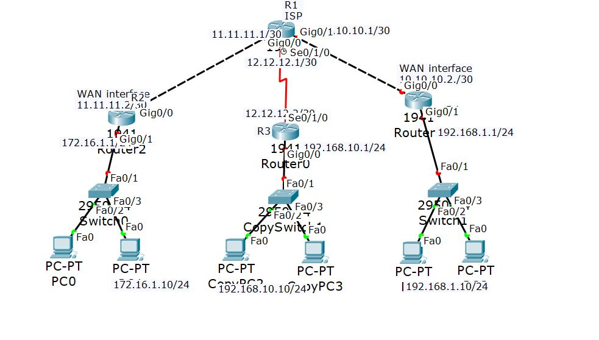

# Network Security — Project 2

A Cisco Packet Tracer network lab by **Hasan Badwan**. The project models three local networks connected through a central ISP router, providing a topology for studying IP addressing, routing, and communication between separate LANs.

## Network topology



The diagram shows:

- **One central ISP router (R1)** connecting the three sites.
- **Three site routers**, each connected to a local switch.
- **Three switches and six PCs**, with two PCs on each LAN.
- **Two Ethernet WAN links and one serial WAN link** between the site routers and the ISP.

## Addressing shown in the diagram

| Site | LAN subnet | LAN gateway | WAN subnet toward ISP |
| --- | --- | --- | --- |
| Left site (R2) | `172.16.1.0/24` | `172.16.1.1` | `11.11.11.0/30` |
| Middle site (R3) | `192.168.10.0/24` | `192.168.10.1` | `12.12.12.0/30` |
| Right site | `192.168.1.0/24` | `192.168.1.1` | `10.10.10.0/30` |

The screenshot also labels example PC addresses of `172.16.1.10/24`, `192.168.10.10/24`, and `192.168.1.10/24`. Some labels overlap; open the Packet Tracer file to inspect the full device configuration.

## Repository files

| File | Purpose |
| --- | --- |
| [Project 2 Hasan.pkt](Project%202%20Hasan.pkt) | Packet Tracer project containing the network lab. |
| [P02.JPG](P02.JPG) | Reference image of the network topology. |

## How to open the project

1. Install Cisco Packet Tracer on your computer.
2. Download this repository using **Code → Download ZIP**, then extract it, or clone it:

   ```bash
   git clone https://github.com/hasanbadwan123/network-security-project-2.git
   ```

3. Launch Packet Tracer and choose **File → Open**.
4. Open `Project 2 Hasan.pkt`.
5. Inspect the routers, switches, and PCs to review their interfaces and settings.

The Packet Tracer version used to create the file has not been recorded. If your installation cannot open it, try a newer version.

## Exploring and checking the network

These are suggested checks to perform in Packet Tracer, rather than recorded test results:

1. On each PC, open **Desktop → IP Configuration** and review its IP address, subnet mask, and default gateway.
2. On each router, inspect the CLI with:

   ```text
   enable
   show ip interface brief
   show ip route
   show running-config
   ```

3. From a PC's **Desktop → Command Prompt**, ping its gateway first, then another PC on the same LAN.
4. Test communication with a PC on another LAN. Successful communication requires working interfaces, suitable routes in both directions, and any configured security rules to permit the traffic.
5. Use **Simulation** mode to follow ARP and ICMP packets and investigate where communication stops.

## Documentation scope

This README describes the supplied topology image. The saved `.pkt` configuration has not been inspected or tested for this documentation update, so the routing method, security features (such as ACLs or VPNs), and end-to-end connectivity are not yet verified. Link colors in the screenshot are a snapshot, not proof of the current lab state.
